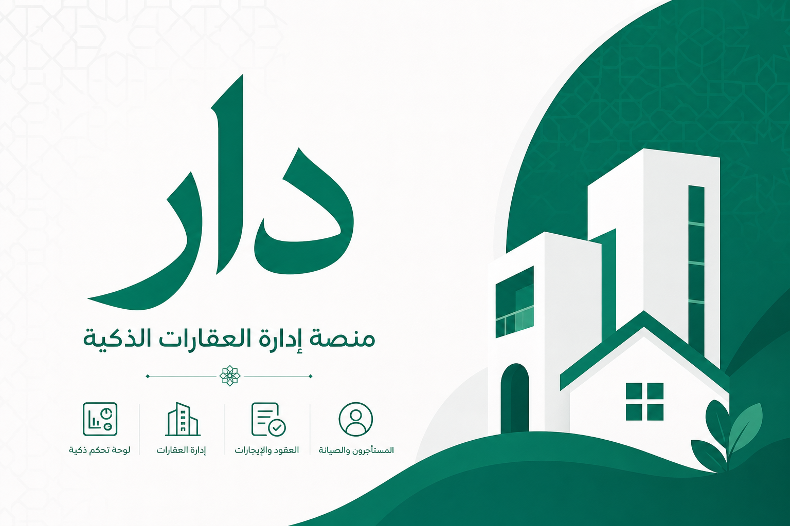

  

# Dar Platform

> Smart property management platform for owners, tenants, and HOA communities — RTL-first, bilingual (Arabic / English), and built for modern real estate in Egypt and beyond.

---

## 🚀 About Us

**Dar** (دار — *home* in Arabic) is a property management platform developed under the [Dar-Platform](https://github.com/Dar-Platform) organization.

Brief introduction about the organization:

- **Who we are** — A product-focused team building an end-to-end digital platform for residential and commercial property management.
- **What problems we solve** — Fragmented leasing workflows, manual billing, poor tenant–owner communication, and limited tools for HOA governance and community decisions.
- **Mission and vision** — To give every stakeholder in the property ecosystem — owners, tenants, and HOA administrators — one trusted place to manage homes, payments, contracts, and community life.

---

## 🎯 Our Mission

Our mission is to simplify property management through intuitive, accessible, and secure software.

**Goals and values:**

- Deliver a **bilingual, RTL-first** experience that works naturally in Arabic and English
- Build **role-based dashboards** tailored to owners, tenants, and HOA communities
- Follow **Clean Architecture** and maintainable engineering practices on both frontend and backend
- Provide **transparent workflows** for leasing, billing, maintenance, and community decisions
- Ship a platform that scales from individual landlords to managed portfolios and HOA buildings

---

## 🏢 Products & Projects

### Featured Projects

| Project | Description | Tech Stack |
|----------|-------------|------------|
| [**Dar-Front**](https://github.com/Dar-Platform/Dar-Front) | Angular web app — marketplace, auth, role dashboards, i18n | Angular 22, TypeScript, Tailwind CSS 4 |
| [**Dar-Server**](https://github.com/Dar-Platform/Dar-Server) | REST API — auth, properties, payments, HOA, and business logic | ASP.NET Core 9, EF Core, SQL Server |
| **Dar Marketplace** | Public property listings and rental applications | Angular, REST API |
| **Dar Score** | Tenant reputation and trust scoring | Angular, .NET |

---

## 🛠️ Technology Stack

### Backend

- ASP.NET Core 9 Web API
- Entity Framework Core 9
- SQL Server
- JWT authentication
- REST APIs · OpenAPI / Swagger

### Frontend

- Angular 22 (standalone components, lazy routes)
- TypeScript 5.9
- Tailwind CSS 4 · Material Design 3
- Vitest · Custom i18n (Arabic / English)

### DevOps & Tools

- Git · GitHub
- GitHub Actions *(planned)*
- Docker *(planned)*
- Azure *(planned)*

---

## 📂 Repository Structure

| Repository | Purpose |
|------------|---------|
| [**Dar-Server**](https://github.com/Dar-Platform/Dar-Server) | Backend API — `Dar.API`, `Dar.Application`, `Dar.Domain`, `Dar.Infrastructure` |
| [**Dar-Front**](https://github.com/Dar-Platform/Dar-Front) | Angular frontend — `dar-app/` SPA |
| [**Dar-Docs**](https://github.com/Dar-Platform) *(optional)* | Shared API specs and architecture decisions |
| [**Dar-Infra**](https://github.com/Dar-Platform) *(optional)* | Docker, CI/CD, and deployment configs |
| **`.github`** | Organization profile and shared GitHub configuration |

---

## 🌟 Development Standards

- Clean Architecture
- SOLID Principles
- Repository Pattern
- Code Reviews
- Git Flow Workflow
- Automated Testing (Vitest · xUnit)

---

## 🔄 Git Workflow

### Branch Strategy

- `main` → Production-ready code
- `dev` → Integration branch (default PR target)
- `staging` → Optional pre-production QA
- `feature/*` → New features
- `fix/*` → Bug fixes
- `hotfix/*` → Emergency production fixes

### Pull Request Process

1. Create feature branch from `dev`
2. Commit changes with clear, imperative messages
3. Push branch to GitHub
4. Open Pull Request targeting `dev`
5. Code review and CI checks (build + tests)
6. Merge into `dev` — release to `main` when ready

> **Full-stack features:** merge **Dar-Server** first, then **Dar-Front**.

---

## 🤝 Contributing

We welcome contributions from team members and collaborators.

### How to Contribute

1. Clone the repository ([Dar-Front](https://github.com/Dar-Platform/Dar-Front) or [Dar-Server](https://github.com/Dar-Platform/Dar-Server))
2. Create a feature branch from `dev` (e.g. `feature/owner-vault-upload`)
3. Commit your changes and run tests locally
4. Submit a Pull Request targeting `dev`

See each repository README for setup instructions and coding conventions.

---

## 👥 Team

**ITI Graduation Project R2-25/26** · .NET Full Stack · **Damanhour Branch**

Graduation project team building the **Dar** platform under the [Dar-Platform](https://github.com/Dar-Platform) organization.

### Supervisor

  
   
  <strong>ENG Omnia El-Sheikh</strong>
   
  Project Supervisor · Full-Stack Developer
   
  <a href="https://github.com/OmniaEl-Sheikh">GitHub</a> ·
  <a href="https://www.linkedin.com/in/omnia-elsheikh/">LinkedIn</a>

### Developers

<table>
  <tr>
    <td align="center">
      
       
      <strong>Ahmed Omar Darwish</strong>
       
      Software Engineer
       
      <a href="https://github.com/AhmedOmarDarwish">GitHub</a> ·
      <a href="https://www.linkedin.com/in/ahmed-omar-darwish/">LinkedIn</a>
    </td>
    <td align="center">
      
       
      <strong>Amr Ayman Elmaghraby</strong>
       
      Software Engineer
       
      <a href="https://github.com/Amr-Elmaghraby">GitHub</a> ·
      <a href="https://www.linkedin.com/in/amr-elmaghraby/">LinkedIn</a>
    </td>
    <td align="center">
      
       
      <strong>Ahmed Mohamed Fouda</strong>
       
      Software Engineer
       
      <a href="https://github.com/fouda12345">GitHub</a> ·
      <a href="https://www.linkedin.com/in/ahmedfouda32/">LinkedIn</a>
    </td>
  </tr>
  <tr>
    <td align="center">
      
       
      <strong>Ahmed Karam Gad</strong>
       
      Software Engineer
       
      <a href="https://github.com/ahmedgaddoo21">GitHub</a> ·
      <a href="https://www.linkedin.com/in/ahmedkaramgad/">LinkedIn</a>
    </td>
    <td align="center">
      
       
      <strong>Adham Raafat Anwar</strong>
       
      Software Engineer
       
      <a href="https://github.com/AdhamSakoury">GitHub</a> ·
      <a href="https://www.linkedin.com/in/adham-raafat-a6549b228/">LinkedIn</a>
    </td>
    <td align="center">
      
       
      <strong>Mohamed Shaker</strong>
       
      Software Engineer
       
      <a href="https://www.linkedin.com/in/mohamed-ahmed-shaker-288310200/">LinkedIn</a>
    </td>
  </tr>
</table>

---

## 📚 Documentation

- [Dar-Front README](https://github.com/Dar-Platform/Dar-Front) — UI setup, routes, architecture, i18n
- [Dar-Server README](https://github.com/Dar-Platform/Dar-Server) — API setup, solution structure, OpenAPI
- [Git & GitHub Structure](https://github.com/Dar-Platform/Dar-Front/blob/main/docs/GIT-STRUCTURE.md) — Branches, PR workflow, front ↔ back coordination
- API Documentation — Swagger UI at `/swagger` (Development)

---

## 📈 Roadmap

### Current Focus

- SaaS platform development (Owner, Tenant, HOA dashboards)
- Backend API integration with Dar-Front
- Authentication, properties, and core domain services
- User experience improvements (RTL, accessibility, Material Design 3)

### Future Goals

- Mobile applications (iOS / Android)
- AI-assisted property insights and maintenance
- Multi-tenant architecture
- Cloud-native infrastructure and CI/CD pipelines

---

## 📞 Contact

- **GitHub:** [https://github.com/Dar-Platform](https://github.com/Dar-Platform)
- **Location:** Egypt
- **Email:** *contact@dar-platform.com* *(update with your official address)*
- **LinkedIn:** *Add your company page URL*

---

## ⭐ Support

If you find our projects useful, consider giving them a star and following our organization on GitHub.

---

© 2026 Dar Platform. All rights reserved.
