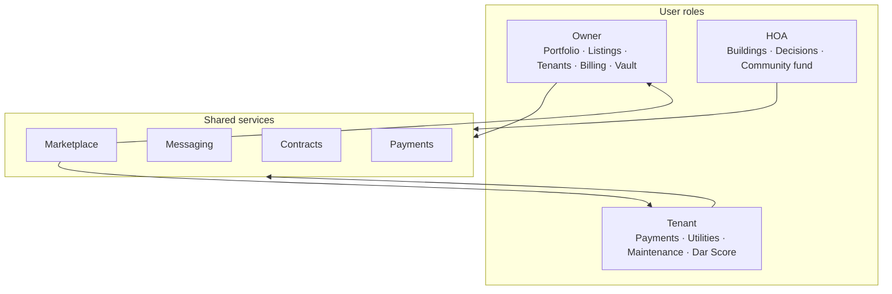
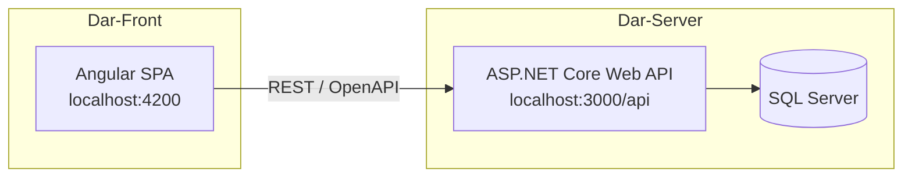

<p align="center">
  
</p>

<h1 align="center">Dar Platform</h1>

<p align="center">
  <strong>Smart property management for owners, tenants, and HOA communities.</strong><br />
  RTL-first · Bilingual (Arabic / English) · Role-based dashboards
</p>

<p align="center">
  
  
  
  
  
</p>

<p align="center">
  <a href="#about">About</a> ·
  <a href="#repositories">Repositories</a> ·
  <a href="#platform">Platform</a> ·
  <a href="#architecture">Architecture</a> ·
  <a href="#getting-started">Getting Started</a> ·
  <a href="#contributing">Contributing</a>
</p>

---

## About

**Dar** (دار — *home* in Arabic) is an end-to-end property management platform for residential and commercial real estate. It connects property owners, tenants, and homeowners associations (HOA) through dedicated dashboards, shared workflows, and a public marketplace.

| | |
|---|---|
| **Focus** | Leasing, billing, maintenance, HOA governance, digital vault, tenant reputation |
| **Audience** | Property owners · Tenants · HOA administrators |
| **Languages** | Arabic (default, RTL) and English (LTR) |
| **Organization** | [Dar-Platform](https://github.com/Dar-Platform) · Egypt |

---

## Repositories

| Repository | Stack | Description |
|------------|-------|-------------|
| [**Dar-Front**](https://github.com/Dar-Platform/Dar-Front) | Angular 21 · Tailwind CSS 4 · TypeScript | Web application — UI, routing, i18n, role dashboards |
| [**Dar-Server**](https://github.com/Dar-Platform/Dar-Server) | ASP.NET Core 9 · EF Core · SQL Server | REST API — auth, properties, payments, HOA, and business logic |

Frontend and backend are maintained as **separate repositories** with aligned branches, releases, and API contracts.

---

## Platform

Dar serves three primary roles through tailored experiences and shared services such as messaging, contracts, and payments.



### Owner

Portfolio overview, property management, rental listings, tenant records, billing and invoices, maintenance marketplace, and a digital document vault.

### Tenant

Rent payments, smart utilities tracking, maintenance requests, and **Dar Score** — a tenant reputation system.

### HOA

Building management, community decisions and voting, and shared fund administration.

### Public

Property marketplace, property detail pages, and authentication flows (login, register, OTP, onboarding).

---

## Architecture



| Layer | Project / area | Responsibility |
|-------|----------------|----------------|
| **Presentation** | `Dar-Front/dar-app` | Standalone Angular components, lazy routes, custom i18n, Material Design 3 |
| **API** | `Dar.API` | HTTP endpoints, OpenAPI / Swagger, Scalar reference |
| **Application** | `Dar.Application` | Services, DTOs, validation |
| **Domain** | `Dar.Domain` | Entities and enums |
| **Infrastructure** | `Dar.Infrastructure` | Persistence, identity, JWT authentication |

**Local development:** run the API and the Angular app side by side — frontend `apiUrl` points to `http://localhost:3000/api`.

---

## Getting Started

### Frontend — [Dar-Front](https://github.com/Dar-Platform/Dar-Front)

```bash
git clone https://github.com/Dar-Platform/Dar-Front.git
cd Dar-Front/dar-app
npm install
npm start
```

Open [http://localhost:4200](http://localhost:4200).

### Backend — [Dar-Server](https://github.com/Dar-Platform/Dar-Server)

```bash
git clone https://github.com/Dar-Platform/Dar-Server.git
cd Dar-Server
dotnet restore
dotnet run --project Dar.API
```

Requires [.NET 9 SDK](https://dotnet.microsoft.com/download) and SQL Server. Configure the connection string in `Dar.API/appsettings.json`.

In Development, the API exposes OpenAPI at `/openapi/v1.json` and Swagger UI at `/swagger`.

### Prerequisites summary

| Component | Requirements |
|-----------|--------------|
| Frontend | Node.js 20+, npm 11.x |
| Backend | .NET 9 SDK, SQL Server |
| Full stack | Both repos running locally (ports 4200 + 3000) |

For detailed setup, routing, and development guides, see each repository’s README.

---

## Contributing

We use a consistent Git workflow across **Dar-Front** and **Dar-Server**:

| Branch | Purpose |
|--------|---------|
| `main` | Production-ready code |
| `dev` | Integration — default target for pull requests |
| `feature/*`, `fix/*`, `hotfix/*` | Short-lived work branches |

1. Branch from `dev` using `feature/`, `fix/`, or `chore/` prefixes
2. Open a pull request targeting `dev`
3. Ensure CI checks pass (build + tests)
4. For full-stack features, prefer merging **Dar-Server** first, then **Dar-Front**

Release tags follow semantic versioning (e.g. `v1.0.0`) and are aligned across repos when possible.

---

## Status

| Area | Status |
|------|--------|
| Frontend UI, routing, i18n | Active — mock data and dev tooling in place |
| Backend API | Active — auth and core services in development |
| Front ↔ back integration | In progress via `environment.apiUrl` |

---

<p align="center">
  <sub>
    <a href="https://github.com/Dar-Platform/Dar-Front">Dar-Front</a>
    ·
    <a href="https://github.com/Dar-Platform/Dar-Server">Dar-Server</a>
    ·
    Built with Angular · .NET · TypeScript
  </sub>
</p>

<p align="center">
  <sub>Proprietary — Dar Platform ©</sub>
</p>
